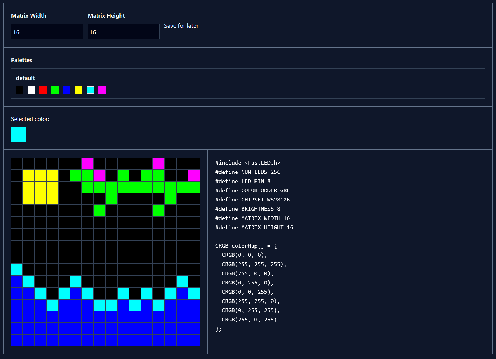

# Pixel Forge

This is a small web app that generates Arduino code for addressable LED matrices. To use, draw using the sprite editor, then copy the generated code into Arduino IDE. You may have to edit some of the `#define` variables at the top of the generated code to match your hardware.

